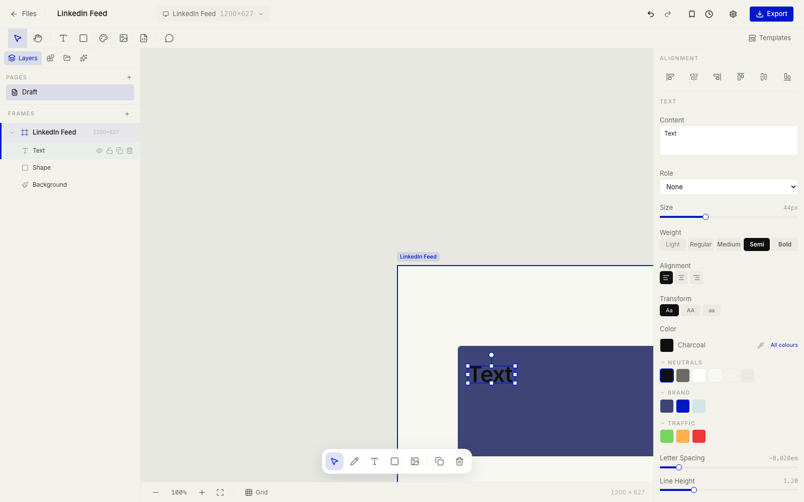

# Canvas Studio

A fast, local-first design canvas for social and ad creatives. Design once, export to every format. No account, no backend, no lock-in — your work lives in your browser.

Built with React 19, Zustand, and Tailwind CSS 4. Rendering runs on a custom SVG-DOM + Canvas-2D engine, colours are computed in OKLCH, and the whole thing is one static bundle you can host anywhere.

> **Status:** source-available showcase. Fork it, self-host it, rebrand it. Issues and PRs are welcome but there's no roadmap commitment.



## Features

- **Multi-format artboards** — LinkedIn, Instagram, Facebook, stories, banners. Design once and reflow across formats with Figma-style layout constraints.
- **Auto Layout** — flexbox-style layout on any group, with direction, gap, padding and alignment. Groups nest, and resizing the container never scales its contents.
- **Real layer model** — text, images, shapes, SVG, gradients, freehand drawing, and background fills (solid, gradient, image, or animated WebGL shader).
- **OKLCH colour** — perceptually-uniform gradients and a themeable brand palette.
- **Live social previews** — see your creative inside a LinkedIn / Instagram / Facebook post mock before you export.
- **Export** — PNG / JPG / WebP at 1x / 2x / 3x, plus one-click auto-resize to every ad format.
- **Local-first** — every project persists to `localStorage`. Nothing leaves the browser.
- **Optional AI Assist** — bring your own endpoint (proxy to Anthropic, OpenAI, or anything) to generate and edit designs from a prompt. Off by default.
- **Scriptable** — drive the canvas from the parent window or devtools via `window.canvasStudio.dispatch(...)`.

## Quick start

```bash
npm install
npm run dev
```

Opens at [http://localhost:17777](http://localhost:17777). To build a static bundle:

```bash
npm run build      # → ./dist
npm run preview    # serve the built bundle locally
```

`npm run typecheck` and `npm run lint` are also available. Any static host (Vercel, Netlify, GitHub Pages, S3, a plain nginx) will serve `dist/` as-is.

## Make it yours

Everything brand-related lives in two files:

| What | Where |
| --- | --- |
| Product name, social handle, website, AI seed copy | [`src/brand/brand.config.ts`](src/brand/brand.config.ts) |
| Colour palette (tokens grouped by neutrals / brand / accent / …) | [`src/brand/palette.ts`](src/brand/palette.ts) |

Change the product name and the sidebar, document titles, exports, and post previews all follow. Swap the palette hexes and every template, gradient, and picker updates. CSS design tokens (background, foreground, radius, shadow) live in [`src/index.css`](src/index.css); the default font is Inter Variable — point `FONT_FAMILY` in [`src/engine/textMeasure.ts`](src/engine/textMeasure.ts) at your own `@font-face` to change it.

Starter templates are plain data in [`src/brand/templates.ts`](src/brand/templates.ts).

## AI Assist (optional)

Canvas Studio ships with no backend and no API keys in the browser. The AI panel is a thin client that POSTs to an endpoint **you** run, so your provider key stays server-side. Enable it with two env vars:

```bash
# .env.local
VITE_AI_API_ORIGIN=https://your-api.example.com
VITE_AI_API_PATH=/api/canvas-ai        # optional, this is the default
```

When `VITE_AI_API_ORIGIN` is unset the AI features stay dormant and the app is fully usable without them. The request/response contract your endpoint must implement is documented in [`docs/ai-endpoint.md`](docs/ai-endpoint.md).

## Ad formats

| Format | Size | Ratio |
|--------|------|-------|
| LinkedIn Feed | 1200×627 | 1.91:1 |
| LinkedIn Sponsored | 1200×1200 | 1:1 |
| Instagram Feed | 1080×1080 | 1:1 |
| Instagram Story | 1080×1920 | 9:16 |
| Facebook Feed | 1200×628 | 1.91:1 |
| Facebook Story | 1080×1920 | 9:16 |
| Banner | 1200×300 | 4:1 |

Formats are defined in [`src/brand/formats.ts`](src/brand/formats.ts) — add your own freely.

## Stack

- **React 19** + **TypeScript** + **Vite 8**
- **Zustand 5** for state, persisted to `localStorage`
- **Tailwind CSS 4** + **shadcn/ui** primitives + **Base UI**
- Custom SVG-DOM live scene + **Canvas-2D** export compositor
- **culori** for OKLCH colour maths, **Paper Shaders** for animated backgrounds
- **motion** for animation

## Project layout

```
src/
  brand/      brand.config, palette, templates, formats, design-system components
  engine/     layout, rendering (SVG + Canvas-2D), text measurement, export
  store/      Zustand stores (design, workspace, files, assets, AI, router)
  components/ canvas surface, panels, inspector, library, UI primitives
  agent/      window.canvasStudio scripting bridge (RPC over postMessage)
  types/      shared TypeScript types
```

## License

[MIT](LICENSE). The bundled Inter font is licensed under the [SIL Open Font License](https://github.com/rsms/inter/blob/master/LICENSE.txt).
