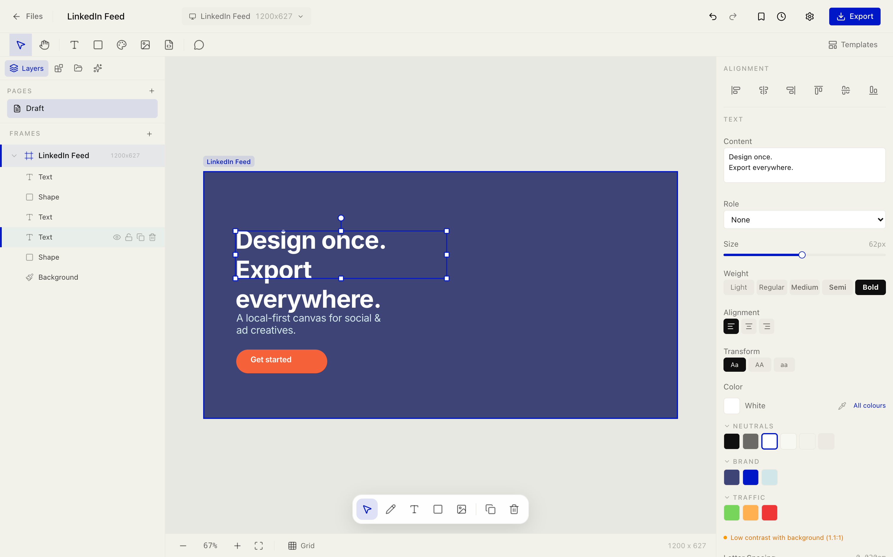
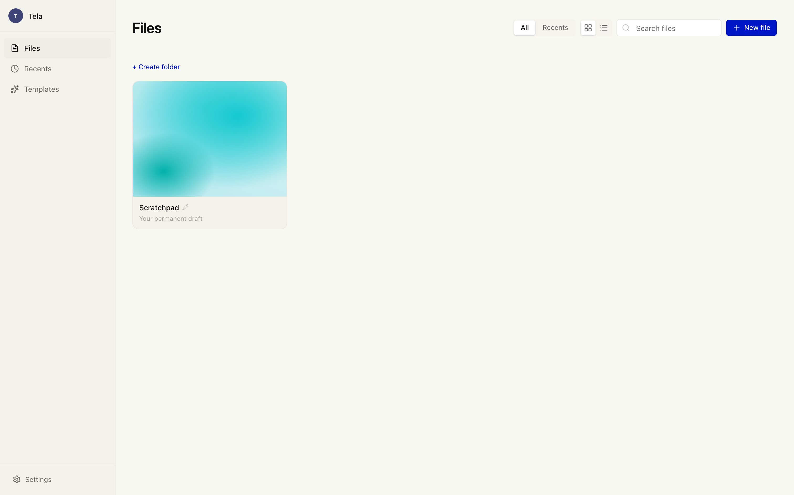
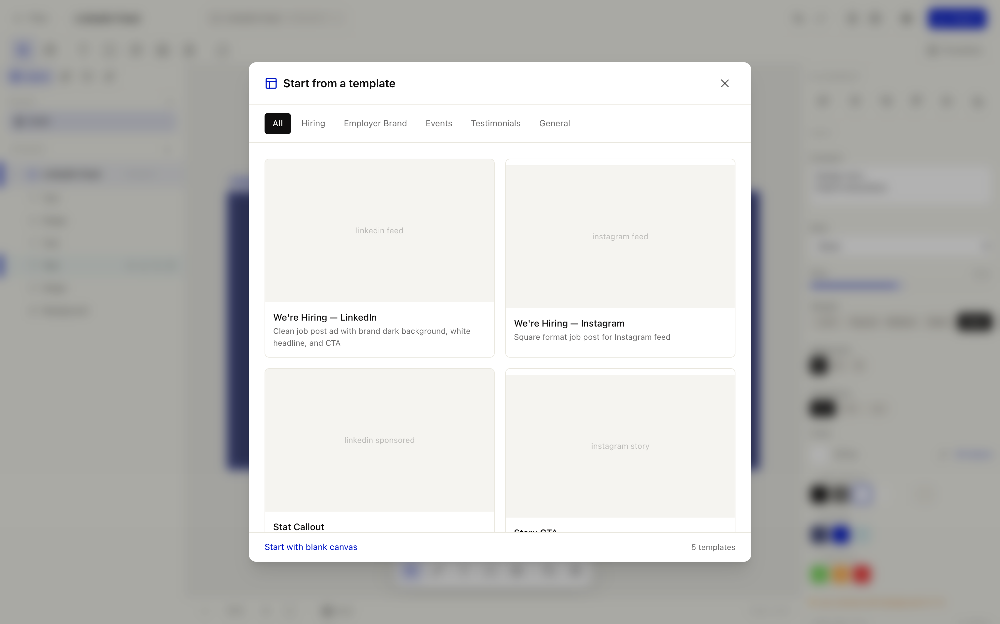
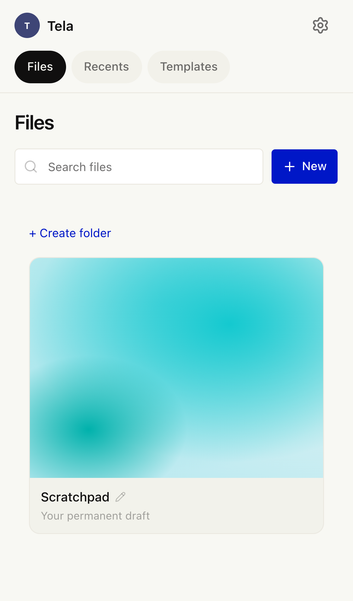
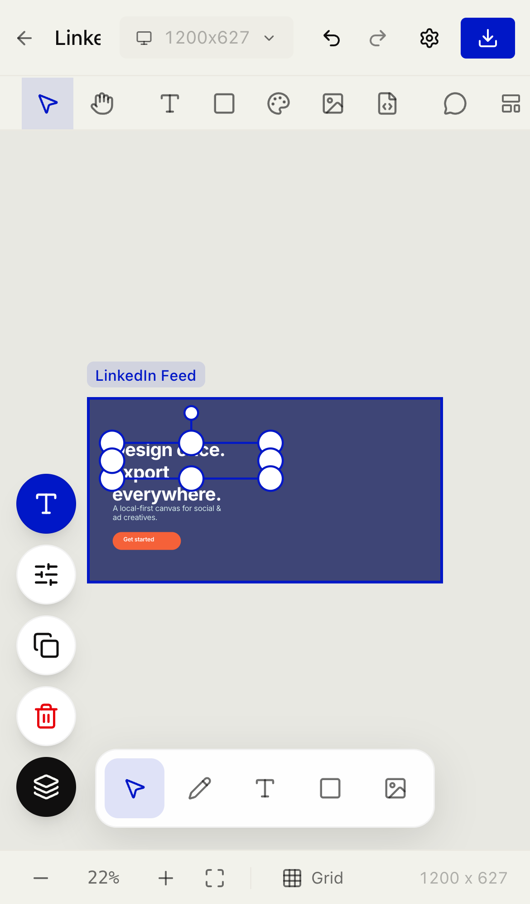
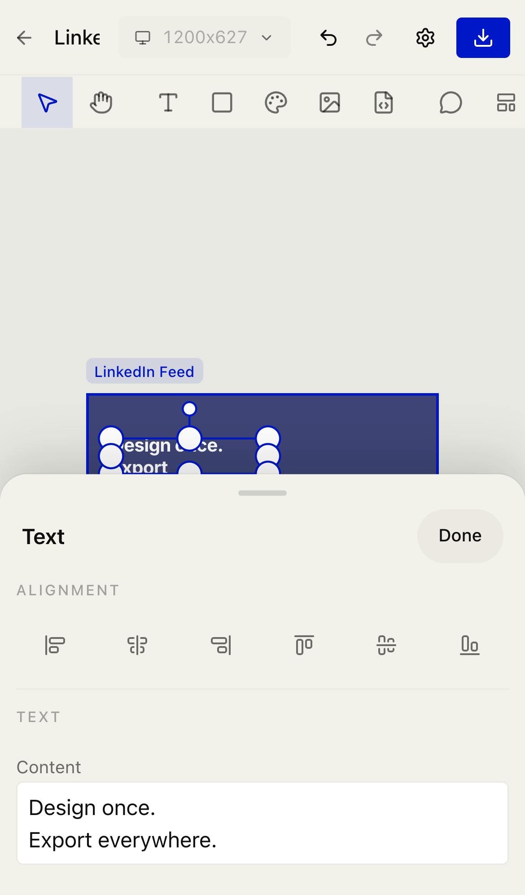

# Tela

**An open-source, local-first design canvas for social & ad creatives — a brandable, self-hostable Figma / Canva alternative.** Design once, export to every format. No account, no backend, no lock-in: your work lives in your browser.

_Tela_ is Portuguese for both **canvas** and **screen**.




> **Status:** source-available showcase. Fork it, self-host it, rebrand it. Issues and PRs are welcome, but there's no roadmap commitment.

## What you can do

- **Start from a template or a blank canvas.** Pick a LinkedIn / Instagram / Facebook layout and edit it, or begin empty.
- **Add and edit any element** — headlines and body text, shapes (rectangle, ellipse, pill, line), images (upload or drag & drop), SVG icons with recolouring, gradients, and freehand pen / highlighter drawing.
- **Compose like a designer** — drag, resize, rotate, align & distribute, snap to guides, group and nest with **Auto Layout**, duplicate, reorder, lock, and hide layers.
- **Style with your brand** — colours from a themeable token palette, OKLCH gradients, corner radius, drop shadow & blur, and animated WebGL shader backgrounds.
- **Design once, publish everywhere** — switch a design between formats (feed, story, banner…) and **auto-resize** it across every ad size in one click.
- **Export** — render your design to **PNG / JPG / WebP** at 1×–3×.
- **Work offline, own your data** — everything saves to your browser. No account, nothing leaves the device.
- **Use it on your phone** — pinch-zoom, drag-to-pan, finger-sized handles, and iOS-style bottom sheets with detents.
- **(Optional) generate with AI** — wire up your own endpoint and describe an ad to have AI compose or re-lay-it-out.

## Screenshots

| The editor | Your files |
| --- | --- |
|  |  |
| Layers, canvas, and a live properties inspector | Local-first file library — nothing leaves your browser |

**Start from a template**



**On mobile** — fully usable on a phone: touch gestures, a contextual selection toolbar, and property editing in a bottom sheet.

<p align="left">
  
  
  
</p>

## What it is

Tela is a focused design editor for the kind of work most teams do in Figma but shouldn't need a full product-design suite for: LinkedIn / Instagram / Facebook posts, stories, banners, and ads. You get a real layer model (text, images, shapes, SVG, gradients, freehand drawing, shader backgrounds), Figma-style multi-select and alignment, and Auto Layout — then export to PNG / JPG / WebP or auto-resize a single design across every ad format at once.

It runs entirely in the browser. There's no sign-up and no server to operate — every project persists to `localStorage`. Drop it on any static host (or embed it in your own app) and it just works.

It's also built to be **made yours**: the entire brand identity — name, colours, fonts, starter templates, social handle — lives in two files, so a fork can become _your_ product in about ten minutes.

## How it works

- **Local-first.** All state (projects, files, assets, settings) is held in Zustand stores persisted to `localStorage`. Nothing leaves the device, and clear-your-data is scoped to Tela's own keys.
- **Two rendering paths, one model.** A live **SVG-DOM scene** renders the canvas you edit (crisp at any zoom, real DOM nodes for hit-testing and text), while a **Canvas-2D compositor** renders the exact same document to a bitmap for export. Both read one shared layer model and one shared text-measurement source, so what you see is what you export — no wrap or overflow drift.
- **OKLCH colour.** Gradients and the themeable palette are computed in the OKLCH colour space (via `culori`) for perceptually-uniform ramps that don't turn muddy through their midpoints.
- **Multi-format by design.** Layers carry Figma-style layout constraints, so one design reflows sensibly when you switch formats — and "auto-resize" fans a design out to every ad size in one action.
- **Optional AI, your keys.** The AI panel is a thin client that POSTs to an endpoint _you_ run. No provider key ever touches the browser, and the whole feature is dark unless you configure it.
- **Scriptable.** A small RPC bridge exposes `window.tela.dispatch(...)` for driving the canvas from a parent window, devtools, or an agent.

## Features

- **Multi-format artboards** — LinkedIn, Instagram, Facebook, stories, banners, and custom sizes. Design once, reflow across formats.
- **Auto Layout** — flexbox-style layout on any group: direction, gap, padding, alignment. Groups nest, and resizing the container never scales its contents.
- **Full layer model** — text, images, shapes, SVG (with recolouring), OKLCH gradients, freehand pen/highlighter, and backgrounds (solid, gradient, image, or animated WebGL shader).
- **Direct-manipulation editing** — drag, resize, rotate, snap-to-alignment, marquee select, alt-drag duplicate, distance measurement, inline text editing.
- **Export** — PNG / JPG / WebP at 1×/2×/3×, plus one-click auto-resize to every format.
- **Themeable brand system** — a token-based palette and a design-system component library, all swappable from config.
- **Zero backend** — static bundle, `localStorage` persistence, instant load.

## How it compares

Tela isn't trying to replace Figma or [Paper](https://paper.design) — they're powerful, general, collaborative tools. Tela is the opposite by design: **small, focused, local-first, and yours.** It's the right pick when you want a purpose-built creative editor you can self-host, embed, and rebrand, rather than a cloud suite you rent.

| | **Tela** | **Figma** | **Paper** |
|---|---|---|---|
| Focus | Social & ad creatives, multi-format export | General product / UI design | Expressive, art-forward canvas |
| Hosting | Local-first, self-host, static bundle | Cloud SaaS | Cloud SaaS |
| Account | None | Required | Required |
| Where data lives | Your browser (`localStorage`) | Vendor cloud | Vendor cloud |
| License | MIT, full source | Proprietary | Proprietary |
| Collaboration | Single-user (fork to extend) | Real-time multiplayer | Multiplayer |
| Rebrand / white-label | Yes — one config file | No | No |
| Embed in your app | Yes — iframe + `window.tela` API | Limited | No |
| AI | Optional, bring-your-own endpoint | Built-in | Built-in |
| Cost | Free | Freemium | Paid |

**vs. Figma** — Figma wins on collaboration, plugins, and breadth. Tela wins on ownership: no account, no cloud, no per-seat cost, and a codebase you can bend to a specific creative workflow (a fixed brand kit, locked formats, an editor embedded inside your own product).

**vs. Paper** — Paper is a beautiful, expressive canvas (Tela actually uses its open-source [shader library](https://github.com/paper-design/shaders) for animated backgrounds). Tela shares that love of OKLCH colour and shader gradients, but points it at a concrete job — producing on-brand, correctly-sized ad creatives — with multi-format export and a themeable brand system baked in.

## Quick start

```bash
npm install
npm run dev
```

Opens at [http://localhost:17777](http://localhost:17777). To build a static bundle:

```bash
npm run build      # → ./dist
npm run preview    # serve the built bundle locally
```

`npm run typecheck` and `npm run lint` are also available. Any static host (Vercel, Netlify, GitHub Pages, S3, a plain nginx) serves `dist/` as-is.

## Make it yours

Everything brand-related lives in two files:

| What | Where |
| --- | --- |
| Product name, social handle, website, AI seed copy | [`src/brand/brand.config.ts`](src/brand/brand.config.ts) |
| Colour palette (tokens grouped by neutrals / brand / accent / …) | [`src/brand/palette.ts`](src/brand/palette.ts) |

Change the product name and the sidebar, document titles, exports, and post previews all follow. Swap the palette hexes and every template, gradient, and picker updates. CSS design tokens (background, foreground, radius, shadow) live in [`src/index.css`](src/index.css); the default font is Inter Variable — point `FONT_FAMILY` in [`src/engine/textMeasure.ts`](src/engine/textMeasure.ts) at your own `@font-face` to change it. Starter templates are plain data in [`src/brand/templates.ts`](src/brand/templates.ts), and formats live in [`src/brand/formats.ts`](src/brand/formats.ts).

## AI Assist (optional)

Tela ships with no backend and no API keys in the browser. The AI panel is a thin client that POSTs to an endpoint **you** run, so your provider key stays server-side. Enable it with two env vars:

```bash
# .env.local
VITE_AI_API_ORIGIN=https://your-api.example.com
VITE_AI_API_PATH=/api/tela-ai        # optional, this is the default
```

When `VITE_AI_API_ORIGIN` is unset the AI features are hidden entirely and the app is fully usable without them. The request/response contract your endpoint must implement — with a working Anthropic proxy example — is in [`docs/ai-endpoint.md`](docs/ai-endpoint.md).

## Ad formats

| Format | Size | Ratio |
|--------|------|-------|
| LinkedIn Feed | 1200×627 | 1.91:1 |
| LinkedIn Sponsored | 1200×1200 | 1:1 |
| Instagram Feed | 1080×1080 | 1:1 |
| Instagram Story | 1080×1920 | 9:16 |
| Facebook Feed | 1200×628 | 1.91:1 |
| Facebook Story | 1080×1920 | 9:16 |
| Banner | 1200×300 | 4:1 |

Add your own in [`src/brand/formats.ts`](src/brand/formats.ts).

## Stack

- **React 19** + **TypeScript** + **Vite 8**
- **Zustand 5** for state, persisted to `localStorage`
- **Tailwind CSS 4** + **shadcn/ui** primitives + **Base UI**
- Custom SVG-DOM live scene + **Canvas-2D** export compositor
- **culori** for OKLCH colour maths, **Paper Shaders** for animated backgrounds
- **motion** for animation

## Project layout

```
src/
  brand/      brand.config, palette, templates, formats, design-system components
  engine/     layout, rendering (SVG + Canvas-2D), text measurement, export
  store/      Zustand stores (design, workspace, files, assets, AI, router)
  components/ canvas surface, panels, inspector, library, UI primitives
  agent/      window.tela scripting bridge (RPC over postMessage)
  types/      shared TypeScript types
```

## Scripting

The canvas exposes a small command bus on `window.tela` for automation and embedding:

```js
// list available commands
window.tela.dispatch({ op: 'getSchema' })

// add a headline and a CTA to the active frame
await window.tela.dispatch({ op: 'addText', text: 'Design once.', x: 80, y: 140, fontSize: 72, colorToken: 'white' })
await window.tela.dispatch({ op: 'addShape', shape: 'pill', x: 80, y: 260, width: 240, height: 60, colorToken: 'ember-500' })
```

## Mobile web

Tela works on a phone, not just a desktop. Touch pinch-zoom and two-finger pan,
finger-sized selection handles, a contextual selection toolbar, property editing
in an **iOS-style bottom sheet with detents**, fullscreen text editing, and
sheet-based Settings / Templates are all in place. The design notes and remaining
polish are tracked in [`docs/mobile.md`](docs/mobile.md).

## License

[MIT](LICENSE). The bundled Inter font is licensed under the [SIL Open Font License](https://github.com/rsms/inter/blob/master/LICENSE.txt).
